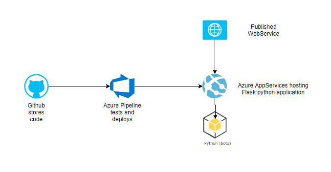
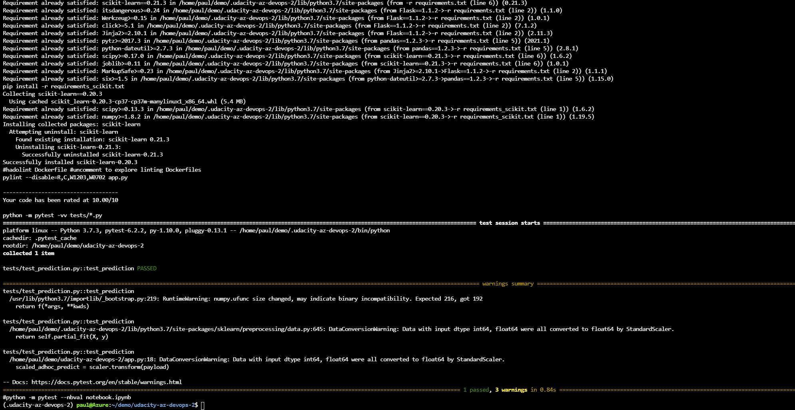
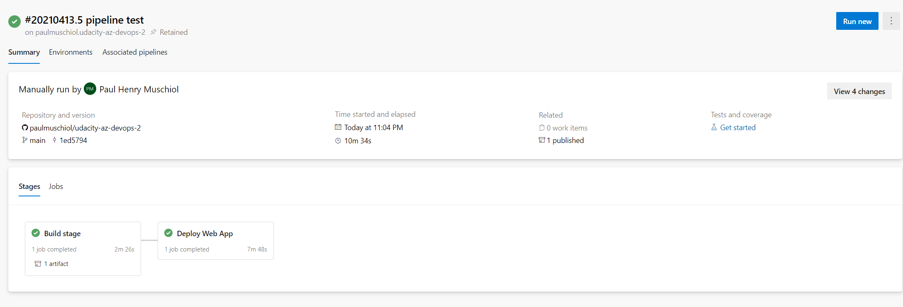

# Overview

Udacity Azure DevOps Project 2
Goal of the project is to setup a small ML app in Azure AppServices using a CI/CD pipeline. It predicts house prices based on input variables. It's running as a small FLASK app.

## Project Plan

* [Trello Board](https://trello.com/b/gBSg2Be7/udacity-devops-r2)
* [Project plan](https://docs.google.com/spreadsheets/d/1eglH8eQMsFBMbxrhoCgWaRv9xnAr1unJ7hDYKaKsSjg/edit?usp=sharing)

## Instructions

Architecture overview

### Preparation

* Open up Azure Cloud Shell. If not done so create SSH Key and add to your github account.
* Clone the project from github into your azure cloud shell
* Create a virtual environment for python to run in.

### Local Deployment

* To setup the evironment locally run `make install_test` in the cloned project folder to install dependencies. If you want you can check the installed dependencies in the [requirement.txt](requirements.txt) files.
* You can now directly deploy your webapp to an Azure WebApp by running `az webapp up -sku F1 -n <your-appservice>` in the project folder in the Azure Cloud Shell. The "your-appservice" must be replaced by a globally unique string identifying your app. This can take a minute to deploy.
* This gives you a web address at the end you can look up. It should give you something similiar to this:

* You can stream your logs in Azure Cloud Shell by `az webapp log tail`. You should see something like below:

* Running `make all` additionally tests your environment. You should get below test result:

### Github Actions

* If you fork or upload the project to Github the actions file in [.github/workflows/pythonapp.yml](.github/workflows/pythonapp.yml) might get detected automaticall. Otherwise go to guthub and setup github action using this pipeline file.
* In case of success the pipeline result should look as below.

### Setup Azure Pipeline

* Go to Azure DevOps and create new project if required
* Navigate to Project Settings / Service Connections and setup a Service connection to your Azure subscription (for details refer to the official documentation). Copy your service connection secret.
* Setup a pipeline by creating a new Pipeline. Refer here to your forked Git Project or setup a Azure Repo. For configuration you can utilize the [azure-pipelines.yml](azure-pipelines.yml) template pipeline.
* Go to your pipeline config in Azure DevOps and add a variable `var-azureServiceConnectionId` holding your service connection secret. You might need to change the webapp name `webAppName` in file azure-pipelines.yml](azure-pipelines.yml) as well to make it globally unique.
* Every commit to master branch now automatically kicks off the pipeline. You should be able to see your pipeline running successfully. The graphical output should be similar to below.
.
* You can further check in Azure Portal that your webapp is now setup and running. If you search for Azure WebServices you should see your app running and even some initial spikes in the resource utilization. 

### Outputs

* You can use the [make_predict_azure_app.sh](make_predict_azure_app.sh) file to test your application. Simply edit the `<yourappname>` to your web app name. You should get ouput similar to the below.

* Find here again a sample output of streamed log files for deployed application. You can do this as described above or go to the Azure Portal, open your App Service and select "Log Stream" in the left menu bar.

## Enhancements
You  might do in future the following:
* upgrade scikit-learn to recent version
* deploy using pre-build docker container and registry
* enhance user interface with interactive input for post request against ML service

## Demo 

* [Screencast Link](https://youtu.be/VsKEh5p6r3M)

